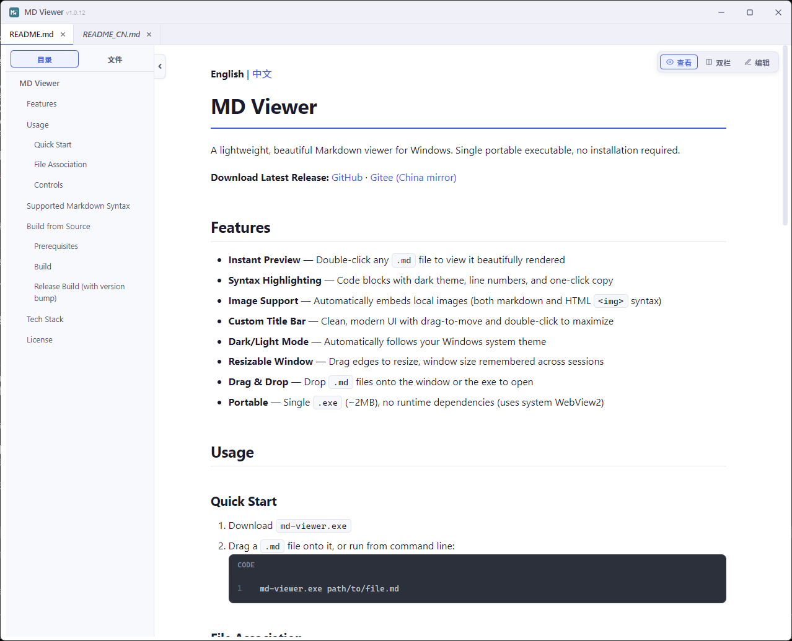

**English** | [中文](README_CN.md)

# MD Viewer

A fast, beautiful Markdown viewer **and editor** for Windows. Multi-tab, file sidebar, live preview, syntax highlighting, paste-to-save images — all in a ~3 MB native app powered by Rust + WebView2.



**[⬇ Download Latest Release](../../releases/)**

## Features

### Viewing
- **Beautiful rendering** — GitHub-flavored Markdown with tables, task lists, footnotes, strikethrough
- **Syntax highlighting** — 50+ languages, line numbers, one-click copy
- **Auto-embedded images** — Local images are inlined (both Markdown and HTML ``)
- **TOC sidebar** — Auto-built outline (h1/h2/h3) with active-section highlighting
- **Files sidebar** — Browse `.md` files in the current folder; click to preview, double-click to pin
- **Dark / Light mode** — Follows Windows system theme automatically

### Editing
- **Three view modes** — `View` (read-only), `Edit` (editor only), `Split` (editor + live preview)
- **Cursor-preview sync** — In Split mode the preview scrolls to the block under your cursor
- **Markdown toolbar** — Headings, bold/italic, lists, tables, code, links, images
- **Slash commands** — Type `/` in the editor to insert blocks (heading, list, table, code…)
- **Paste images** — `Ctrl+V` an image: saved into `images/` next to the doc, link inserted automatically
- **Save** — `Ctrl+S` writes back to disk; close prompts if there are unsaved changes

### Tabs & windows
- **Multi-tab** — Open many docs, drag-drop to add, middle-click to close
- **Preview vs. pinned tabs** — Single-click in the file tree opens a preview tab (italic); double-click or edit pins it
- **External-edit auto-reload** — If the file is changed by another editor, the rendered view refreshes automatically (your unsaved edits are preserved)
- **Inter-doc `.md` links** — Click `[中文](README_CN.md)` in rendered Markdown to open it as a preview tab inside the app
- **Single instance** — Re-opening `.md` files from Explorer routes them into the existing window
- **Custom title bar** — Borderless, drag to move, double-click to maximize, edges resize
- **Remembered geometry** — Window size persists across sessions

## Install

1. Download `md-viewer-setup-vX.Y.Z.exe` from [Releases](../../releases/)
2. Run the installer — by default it associates `.md` / `.markdown` files and adds an **Open with MD Viewer** entry to the right-click menu
3. Double-click any `.md` file, or run `md-viewer.exe path\to\file.md` from a terminal

> The installer requires no admin rights — it installs to your user profile by default. WebView2 (pre-installed on Windows 10/11) is the only runtime dependency.

## Keyboard shortcuts

### File & window
| Shortcut | Action |
|---|---|
| `Ctrl+O` | Open file dialog |
| `Ctrl+S` | Save the active tab |
| Drag-drop | Open one or more `.md` files |
| Middle-click tab | Close tab |
| Double-click title bar | Maximize / restore |

### Formatting (Edit / Split mode)
| Shortcut | Action |
|---|---|
| `Ctrl+1` / `Ctrl+2` / `Ctrl+3` | Heading H1 / H2 / H3 |
| `Ctrl+B` | **Bold** |
| `Ctrl+I` | *Italic* |
| `Ctrl+Shift+X` | ~~Strikethrough~~ |
| `Ctrl+E` | Inline `code` |
| `Ctrl+Shift+E` | Code block (fenced) |
| `Ctrl+Q` | Blockquote |
| `Ctrl+L` | Bulleted list |
| `Ctrl+Shift+L` | Numbered list |
| `Ctrl+T` | Task list |
| `Ctrl+K` | Link |
| `Ctrl+Shift+I` | Image |
| `Ctrl+Shift+M` | Table |
| `Ctrl+Shift+H` | Horizontal rule |
| `Ctrl+Z` / `Ctrl+Y` | Undo / Redo |
| `/` (in editor) | Slash-command popup |

## Supported Markdown

Headings · bold · italic · strikethrough · ordered / unordered / task lists · tables · fenced code blocks with syntax highlighting · blockquotes · images (local & remote) · links · horizontal rules · inline HTML (`<p>`, ``, `<details>`, …).

## Build from source

### Prerequisites
- [Rust](https://rustup.rs/) (stable)
- Windows 10/11 with WebView2 (shipped by default)
- (Optional, for installer) [Inno Setup 6](https://jrsoftware.org/isdl.php)

### Build
```bash
cargo build --release
```
Output: `target/release/md-viewer.exe`.

### Release (bump version + build installer)
```bash
python release.py
```
Bumps the patch version in `Cargo.toml`, builds release, then invokes Inno Setup to produce `dist/md-viewer-setup-vX.Y.Z.exe`.

## Tech stack

- **Rust** — fast startup, ~3 MB binary
- **[wry](https://github.com/tauri-apps/wry)** — WebView2 bindings
- **[tao](https://github.com/tauri-apps/tao)** — windowing
- **[pulldown-cmark](https://github.com/raphlinus/pulldown-cmark)** — Markdown parsing
- **[syntect](https://github.com/trishume/syntect)** — syntax highlighting (base16-ocean.dark)

## License

MIT
